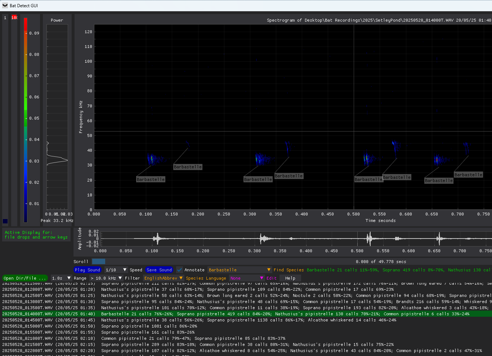
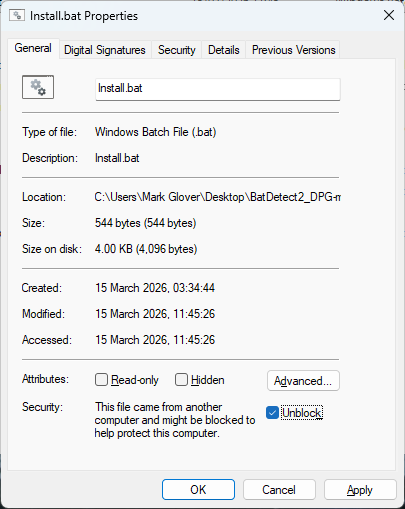
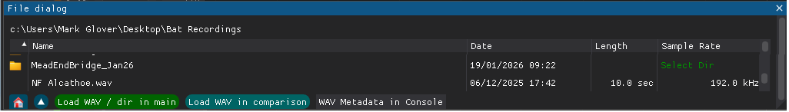
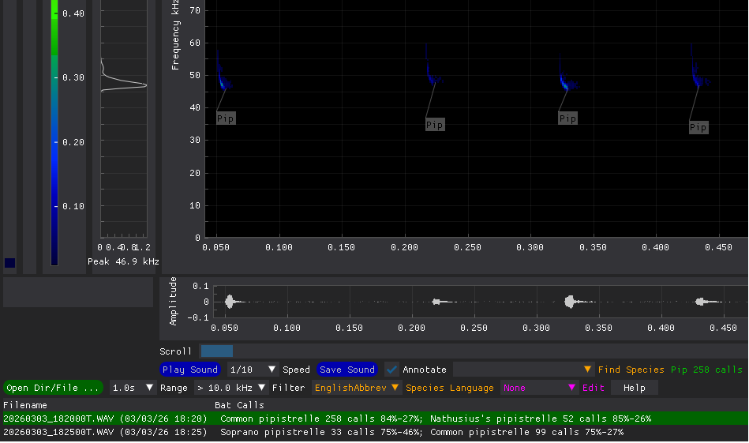
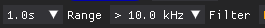

# Bat Detect GUI

This is a Python Graphical User Interface using DearPyGui for the Bat Call Classifier BatDetect2.
It incorporates many of the features recommended for professional bat ecologists to seek in commercial software.

## Install

   -   Unzip 'BatDetect2 DPG' directory in preferred location
   -   Windows: right click 'install.bat', select 'Properties',  tick 'Unblock' box and press 'OK'
   -   Linux: chmod u+x install.sh
   -   run 'Install.bat' in windows or 'install.sh' on Linux
   -   Windows: right click 'run.bat', select 'Properties',  tick 'Unblock' box and press 'OK'
   -   Linux: chmod u+x run.sh
 
 
 
The UV package manager creates a virtual environment and installs Python, all latest modules used 
and  a desktop short cut is created.
 
## Use

### Load a single wav file

-   Drag the file onto 'Bat Detect GUI' window
   -   Or press 'Open Dir/File...'
       -   Add top level folders that contain bat recordings (these are remembered)
       -   Select file (via single click) and press 'Load WAV / Dir in main'

The wav file will be classified for bat echolocation call, this will be displayed as annotations on the spectrograph and are retained in the 'ann' subdirectory.
 
  ### Load a directory of wav files
 
   *   Drag the directory onto 'Bat Detect GUI' window
   *   Or press 'Open Dir/File...'
        *   Add top level folders that contain bat recordings (these are remembered and a Classify.bat file is created, see below)P
        *    Press 'Select Dir' button at end of directory line and press 'Load WAV / Dir in main'.
    *   Or in Windows File Explorer drag directory into Classify.bat file. This is quicker as it does not need to display GUI. This file can be copied to be nearer the directory, This file is created in all added top level folders.
    *   Or in Linux terminal type ./classify.sh and drag the folder in to provide the path.

All the wav files will be classified for bat echolocation calls, this may take some time and are retained in the 'ann' subdirectory. Wakepy should stop the PC sleeping while the files are classified
The files will be listed in a table at the bottom of the GUI. It will scroll to the first consecutive calls.
To scroll to the most probable of another species select 'Find Species' combobox.

 #### Display coordinates on any graph

*   Click on graph
 
The time, frequency or power values will display in the bottom right hand corner of the spectrogram

 #### Display frequency of maximum energy
 
 This is shown at the bottom of the power spectrogram. 
  Zoom in on call(s) to get a more accurate values. Filtering out strong noise with the 'Filter' combo-box will help.  

 #### Zoom in on spectrogram area

  *   Normal left click and drag to define area to be zoomed. Double click to unzoom.
  *   Or use scroll wheel on mouse
  *   Or alter the 'Range' combo-box, this will be retained

 The amplitude and power graphs will alter to also display the zoomed area.
 
  #### Play Bat Call Sound
 
   *   Select 'Speed' combo-box,
   *   Press 'Play Sound' button
Some sounds are easier to recognise as sounds than spectrograms. Bat sounds are normally played at 1/10 speed to be audible. When this button is pressed a vertical cursor will show the sound being played on the spectrogram. The default sound replay on spectrogram movement does not show a cursor for reliability. Crickets may be better at 1/2 or very high frequency bats at 1/20 speed.

 #### Alter area in spectrogram
 
 *   Left and right arrow keys move spectrogram window one windows worth in time
 *   Or click on scroll bar
 *   Up and down arrow keys move spectrogram one file
 *   Or click on table row
 *   'Range' combo-box alters size of spectrogram window
 *   'Filter' combo-boxes reduce displayed graphs and filter played sound. This can removed audible or other noise, but may hide the fact that a bat call is in fact an audible noise harmonic. 

 
 
The new area will have its time expanded sound play automatically, this will stop short if the spectrogram area is changed.
    
 #### Save Bat Call Sound
 
*   Select 'Speed' combo-box,
 *   Press 'Save Sound' button
 
 Saves only displayed sound, file-name based on originating file and in the same directory.  
 Time expanded recordings names end with 'TE.wav'
 
 #### Save current settings
 
   *   If you exit by closing the GUI the current settings will be retained
   *   If you exit by closing the console the current settings will not be retained.
 
 ### BTO Pipeline Use
 
 #### Split long files for pipeline
   *   Press 'Open Dir/File...', navigate to directory
   *   Press 'Select Dir' button
   *   Press 'Split Long WAVs' button
 
   #### Load results from pipeline
   *   copy results '.csv' from BTO pipeline email into directory processed
   *   Press 'Open Dir/File...', navigate to directory
   *   Press 'Select Dir' button
   *   Press 'Load WAV / Dir in main' button
 
   The summary should be displayed in a similar way to BatDetect2, but there is no annotation available from the BTO.
### Mobile Echo Meter Touch Use

 *   Save one or more Echo Meter sessions in a separate directory (from Android Documents>EchoMeter>Recordings)
 *   Drag the directory onto 'Bat Detect GUI' window
 *   Go into the directory and press 'Load WAV / Dir in main'. 
 A table of the all session contents will be displayed with an Echo Meter and a BatDetect2 classification per WAV file
 *   Check recording classification for most notable species in file, 'Assign species' to any incorrect
 *   Press 'Save Map' to generate HTML map of species locations with hyper-links to time expanded files 
 
##   Expert Use
 
#### Display time interval on Spectrograph
 
 *   Click on start,
 *   Click on end

 A horizontal annotation will display ending in the time in milliseconds
 
 #### Manually compare calls with reference material
 
  *   Press a key while drag and dropping reference file onto GUI window
  *   Or use 'Open Dir/File..' select reference file and press 'Load comparison WAV'
 
 Two spectrograms will be displayed. 
 You can play or zoom in or measure on either window. 
 The arrow keys will work with the 'Active Display' press the 'Press to activate' button to change the active display.
 
 #### Alter colour thresholds in spectrogram
 
 *   Drag blue slider to alter min level (black to blue threshold)
 *   Drag red slider to alter max level (all above is red)
 
 This can result in weak signals becoming clearer. 
 The min is automatically adjusted when the spectrogram moves.
 
#### Change or add classification of a call

 *   Select 'Source' in the  'Edit' combo-box,
 *   Select species in 'Assign Species' combo-box,
 *   Select type in 'Call Type' combo-box,  
    
 *   Right click drag to select area of call. Unfortunately you will not get the same feedback as when zooming. 
 
The annotation should be added and any included calls deleted. 
The new classification will be retained in the 'ann' directory. 

#### Display of wav file metadata
* Select file in 'Open Dir/File ...' dialogue. 
* Press 'WAV Metadata in console' button
Meta data is manufacturer / firmware version dependant, so just displaying as text. DearPyGui popup windows are very performance sensitive, so displaying in console.